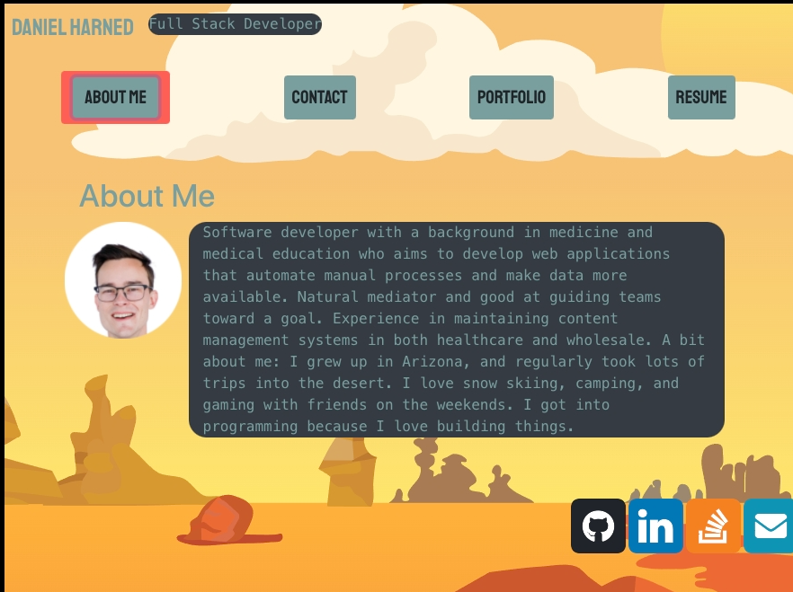

# React-Portfolio Daniel H.
This is my portfolio showcasing some of my projects, peruse and enjoy.

  
  
  

  ## Description

  

  This application is deployed to Heroku.

  This is my website, I built it to show off some of my projects and skills! Take a look through my projects, peruse my resume, read a bit about me, and if you like what you see, send me an email.

  The front end of this site was built primarily with react.js, and is a single-page-website. React-Bootstrap powers the form and much of the styling. The backend is built entirely on express.js and is primarily there to serve my projects from the github api through a graphql query.

  ## Table of contents

  * [Installation](#installation)
  * [Usage](#usage)
  * [Maintainers](#maintainers)
  * [Tests](#tests)
  * [Credits](#credits)
  * [License](#license)

  ## Deployment
  [Heroku Deployment](https://portfolio-dh.herokuapp.com/)

  ## Installation
  No install required! If you want to deploy it somewhere else for some reason (hey, free advertising!), that can easily be done by cloning the repo.

  ## Usage
  Go straight to the deployment, and start looking around!

  ## Maintainer
  [@Daniel Harned](https://github.com/DrDano)

  ## Credits
  
  * [react.js](https://reactjs.org/)
  * [react bootstrap](https://react-bootstrap.github.io/)

  ## License
  Licensed under [MIT](https://choosealicense.com/licenses/mit) 2022 
  
  